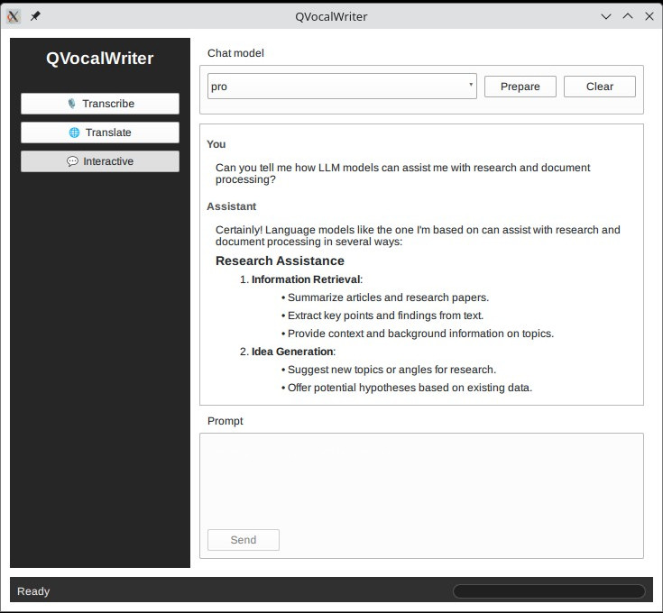

# QVocalWriter

**QVocalWriter** is a cross-platform, local-first application for working with spoken and written language.
It started as a speech-to-text tool for long-form writing and has grown into a modular
toolset with independent features for **transcription**, **translation**, and **assistant-based chat**.

The project is under active initial development, with an emphasis on clean C++ APIs, a QML-based UI,
and extensibility across platforms.

The focus remains on:

* Long-form content (articles, blog posts, books)
* Offline or self-hosted model usage
* Clear separation between features and models
* Privacy-respecting workflows



## Features

* **Transcription**
  Convert speech to text with support for longer recordings and structured output.

* **Translation**
  Translate text or transcriptions between languages using local models.

* **Assistant Chat**
  Interact with a local language model for drafting, rewriting, summarizing, or refining text,
  as well as researching, experimenting, or playing with local models of various sizes and capabilities.

Each feature is designed to work independently, sharing models and infrastructure where
it makes sense, but without tight coupling.

## Building

### Prerequisites

* CMake
* Qt 6.10 or later (Qt Quick and QML modules)

### Build instructions

```bash
mkdir build
cd build
cmake ..
cmake --build .
```

### Running

```bash
./build/bin/QVocalWriter
```

